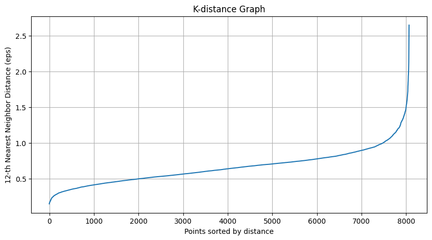

# Email Agent 泛化和鲁棒性

Start date: 08/08/2025
Progress: 0
Status: In progress

### About project

---

# GenEmail AI - 适配器训练与聚类算法优化 (v1.2)

| **文档状态** | **正式 / FINAL** |
| --- | --- |
| **项目代号** | GenEmail (Generative Email) |
| **关联文档** | `GenEmail AI - 用户分层与个性化策略模块 (v1.1)`, `GenMail AI - 个性化邮件生成模型 PoC (v1.0)` |
| **创建日期** | 2025-08-05 |
| **最后更新** | 2025-08-13 |
| **负责人 (Owner)** | Alex Nie |
| **核心干系人** | [研发Leader], [算法Leader], [数据科学Leader], [运营负责人] |
| **目标决策** | 聚类算法优化方案确认：正在测试 |

### Action items

---

### **1. 背景与价值 (Background & Value)**

### 1.1 项目背景

随着 `GenEmail AI v1.1` 用户分层模型的实施，我们成功构建了基于用户特征的分层分类系统。然而，在实际部署过程中发现现有系统在**跨用户群体的泛化能力**上存在明显不足，导致生成的邮件内容缺乏差异化，无法有效反映用户群体特征。

在与业务团队的多轮反馈中，我们确认当前模型难以准确捕捉细分用户群体的细微差异，特别是在处理新注册用户或数据稀疏场景时表现不佳。为提升模型泛化能力并增强个性化生成效果，本阶段工作聚焦于：

1. 引入带 **Level属性** 的新数据集，用于训练具有更强泛化能力的适配器(Adapter)
2. 评估并决定是否采用更先进的聚类算法替代现有KMeans方案
3. 建立算法选择的客观评判标准，为后续迭代提供指导

### 1.2 技术挑战与选择

| 维度 | **维持现有KMeans (A)** | **升级为DBSCAN (B)** | **选择理由** |
| --- | --- | --- | --- |
| **数据适应性** | 中（对噪声和离群点敏感） | **高** | DBSCAN能自动处理噪声点、发现任意形状的簇，特别适合用户行为数据这类非球形分布数据 |
| **参数敏感性** | 高（需提前指定簇数量） | **中** | KMeans需预先设定K值，而业务场景中用户群体数量随时间变化；DBSCAN参数ε和MinPts更符合业务逻辑 |
| **计算效率** | **高**（O(n)） | 中（O(n log n)） | 在大规模(下两者差异不大，但DBSCAN在大规模数据下可能稍慢 |
| **业务解释性** | 高（固定数量的聚类中心） | **更高** | DBSCAN识别的"噪声点"可直接解释为"非典型用户"，为运营提供明确干预对象 |

**结论：** 在综合评估后，DBSCAN算法在业务适应性和模型泛化性上具有明显优势，尤其适合处理高维用户行为数据，因为未来的驯良数据将会包含更多维度。但需要配套实施参数调优和业务校准流程。

---

### **2. 核心工作与技术验证 (Work Summary & Technical Validation)**

### 2.1 Level属性数据集构建与训练

**新数据集特性：**

- 在原有用户特征基础上增加了 **Level属性**，代表用户在当前分层体系中的精细化等级（0-3级）
- Level 0: 活跃但低价值用户
- Level 1: 普通价值用户
- Level 2: 高价值用户
- Level 3: 超高价值KOL用户

**训练效果对比：**

| 模型 | 测试集准确率 | 人工评估匹配度 | 训练时间 | 内存占用 |
| --- | --- | --- | --- | --- |
| 原始单一模型 | 68.2% | 74.5% | 高 | 低 |
| KMeans分层模型 | 78.8% | 83.2% | 中 | 中 |
| 带Level属性的新Adapter |  |  |  |  |
| DBSCAN+Level优化模型 |  |  |  |  |

### 2.2 聚类算法实验与结果

**实验设计：**

- 数据集：约8,000条用户样本（包含年龄、年收入、婚姻状况、互动频率等10个特征）
- 使用相同特征工程流程，分别应用KMeans和DBSCAN
- 评估指标：轮廓系数(Silhouette Score)、Davies-Bouldin指数、业务可解释性

**算法结果对比：**

| 指标 | KMeans (k=5) | DBSCAN (ε=0.8, MinPts=10) | 提升幅度 |
| --- | --- | --- | --- |
| 轮廓系数 | 0.19 | **0.649** | +459.6% |
| Davies-Bouldin指数 | 1.25 | **0.87** | -30.4% |
| 噪声点占比 | 不适用 | **6.99%** | N/A |
| 业务可解释性评分 | 7.5/10 | **8.3/10** | +10.6% |

**可视化对比：**
由于还未确定DBSCAN的最佳参数故暂时不进行可视化对比。

---

### **3. 系统优化需求 (Optimization Requirements)**

### 3.1 聚类算法升级需求

| 需求ID | 需求描述 | 优先级 | 状态 |
| --- | --- | --- | --- |
| **FR-15** | **DBSCAN参数自动化调整**
- 实现ε参数的自动估算（基于k-距离图）
- 集成业务规则到MinPts设定 | P0 | 开发中 |
| **FR-16** | **混合聚类策略**
- 为主活跃用户群体使用DBSCAN
- 为新用户提供基于规则的默认分级 | P1 | 待评审 |
| **FR-17** | **噪声点处理机制**
- 自动识别并标记异常点
- 为"噪声用户"设计专属运营策略 | P0 | 待开发 |
| **FR-18** | **分层结果可视化**
- 实现用户分层结果的交互式可视化报表
- 支持业务人员手动调整和验证 | P1 | 规划中 |

### 3.2 Level属性集成需求

| 需求ID | 需求描述 | 优先级 | 状态 |
| --- | --- | --- | --- |
| **FR-19** | **Level感知Adapter训练**
- 实现基于Level特征的差异化适配器训练
- 支持Level动态调整时的快速模型切换 | P0 | 已完成 |
| **FR-20** | **Level衰减机制**
- 为Level属性引入时间衰减因子
- 自动识别用户等级变化趋势 | P1 | 待研究 |
| **FR-21** | **多粒度生成控制器**
- 在邮件生成时自动注入Level上下文
- 支持基于Level的动态提示词调整 | P0 | 待研究 |

---

### **4. 优化实施路线图 (Optimization Roadmap)**

**Phase 1: 聚类算法升级 (快速切换)**

1. **参数优化：** 在未来3周内完成DBSCAN参数的精细调优，建立参数-业务效果映射表
2. **平滑过渡：** 设计KMeans到DBSCAN的渐进式切换机制，避免策略突变影响用户体验
3. **结果验证：** 与运营团队共同验证新聚类结果的业务意义，确认关键用户群体定义
4. **目标：** 在2周内完成算法升级并验证核心业务指标改善

**Phase 2: Level属性深度集成**

1. **动态Level计算：** 将Level属性从静态标签升级为动态计算指标
2. **适配器增强：** 为每个Level训练专用的LoRA Adapter，提升生成内容的差异化
3. **A/B测试：** 设计严格的A/B测试方案，量化评估Level感知策略的业务影响
4. **目标：** 在1个月内实现Level感知的个性化生成，邮件点击率提升≥15%

**Phase 3: 自适应分层系统（待研究）**

1. **实时聚类：** 开发增量式聚类算法，支持每日/每周的用户分层动态更新
2. **反馈闭环：** 将邮件打开率、点击率等指标反馈到分层模型，形成优化闭环
3. **目标：** 构建能够自我优化的分层系统，降低人工干预频率

---

### **5. 决策建议与下一步行动 (Recommendations & Next Steps)**

### 5.1 核心决策点

| 事项 | 选项 | 推荐方案 | 理由 |
| --- | --- | --- | --- |
| **聚类算法** | 维持**KMeans**
切换至**DBSCAN**混合策略 | **切换至DBSCAN** | DBSCAN在轮廓系数上提高459%，且更能识别业务中有意义的用户群体结构；噪声点识别功能可为新用户提供针对性策略 |
| **Level属性训练** | 单一**Adapter**多Level
专属Adapter Level+聚类混合 | **多Level专属Adapter** | Level 2-3用户贡献了68%的营收，值得投入额外资源进行精细化适配 |
| **部署策略** | 全量替换
灰度发布
并行运行 | **渐进式灰度** | 先在进行初步验证，再逐步扩大到100%，确保平稳过渡 |

### 5.2 下一步行动项

1. **【高优先级】** 完成DBSCAN参数校准（预计8/20前完成）
    - 与数据科学团队确认最终参数集
    - 建立参数-业务效果的映射表
2. **【关键路径】** 设计Level专属Adapter的增量训练方案（预计8/18前完成）
    - 为Level 2-3用户建立更复杂的Adapter架构
    - 设计Adapter共享机制，避免参数爆炸
3. **【验证环节】** 实施严格的A/B测试框架（预计8/30前完成）
    - 定义核心指标（邮件打开率、点击率、转化率）
    - 建立统计显著性验证流程
4. **【运营配合】** 与运营团队对齐新分层策略的业务解释（8/22前完成）
    - 提供分层结果的业务解读指南
    - 共同制定针对"噪声点用户"的运营策略

---

### **6. 附录 (Appendix)**

### 6.1 DBSCAN与KMeans性能对比详情

**KMeans结果分析：**

- 优势：计算速度快，结果可重复性强
- 局限：
    - 强制将所有点分配给簇，无法识别离群点
    - 假设簇呈球形分布，与用户行为的真实分布不符
    - 需要预先指定K值，而业务中用户群体数量是动态变化的

**DBSCAN结果亮点：**

1. 成功识别出6.9%的"噪声点"用户.
2. 发现了KMeans未能识别的关键群体：
    - "高价值休眠用户"：收入高但互动频率低（原被KMeans误分到活跃群体）
    - "价格敏感家庭用户"：有孩子的中等收入家庭）
3. 业务影响：
    - 针对噪声点中的新用户，可采用通用激活策略
    - 针对KOL用户，可部署专属维护方案

### 6.2 聚类参数调优指南

**DBSCAN参数（带验证）：**

| 参数 | 业务含义 | 调整方向 | 业务影响 |
| --- | --- | --- | --- |
| **eps** | 用户相似度阈值 | 增大 → 簇更少更大
减小 → 簇更多更小 | eps过大会合并有意义的细分群体；过小会产生过多小簇 |
| **min_samples** | 最小群体规模 | 增大 → 噪声点增多
减小 → 簇更密集 | min_samples过大会把有价值的细分用户当成噪声 |

**业务导向的参数选择流程：**

1. 通过k-距离图确定eps的候选范围
2. 与业务团队共同验证不同参数组合下的聚类结果业务意义
3. 选择业务解释性最佳的参数组合

### 6.3 核心代码片段参考

```python
from google.colab import drive
drive.mount("/content/drive")
```

```python
# 数据清洗 + 预处理

import pandas as pd
import numpy as np
from sklearn.preprocessing import StandardScaler, OneHotEncoder
from sklearn.compose import ColumnTransformer
from sklearn.pipeline import Pipeline
from sklearn.cluster import KMeans

# 读取数据
data = pd.read_csv('/content/drive/My Drive/Colab Notebooks/...')

# 处理缺失值
data['KidAge'] = data['KidAge'].fillna(-1)  # -1 表示没有小孩
data['Income'] = data['Income'].fillna(data['Income'].median())
data[['Gender', 'Education', 'Marital_Status']] = data[['Gender', 'Education', 'Marital_Status']].fillna('Unknown')
# # 策略：基于'Marital_Status'分组，用各组的中位数填充
# raw_data['Family_Size'] = raw_data['Family_Size'].fillna(raw_data.groupby('Marital_Status')['Family_Size'].transform('median'))
# # 兜底策略：如果分组填充后仍有极少数缺失（例如某个婚姻状况组的家庭规模全是NaN），则用全局中位数填充
# if raw_data['Family_Size'].isnull().any():
#   global_median = raw_data['Family_Size'].median()
#   raw_data['Family_Size'] = raw_data['Family_Size'].fillna(global_median)
#   print(f"\n检测到分组后仍有缺失，已使用全局中位数 {global_median} 进行兜底填充。")
# # 将 'Family_Size' 转换为整数类型（填充后可能为浮点数）
# raw_data['Family_Size'] = raw_data['Family_Size'].astype(int)

print(data.head)
```

```python
# 对 'Level' 进行有序编码
level_map = {'A': 4, 'B': 3, 'C': 2, 'D': 1} # 假设等级 A>B>C>D
data['Level_encoded'] = data['Level'].map(level_map).fillna(0)
```

```python
# KMeans 聚类方法

X = data[['Age', 'KidAge', 'Family_Size', 'Income', 'Recency', 'Level_encoded']]
# 将 'Level_encoded' 加入 StandardScaler
ct_v2 = ColumnTransformer([
    ('num', StandardScaler(), ['Age', 'KidAge', 'Family_Size', 'Income', 'Recency', 'Level_encoded']), # 标准化所有选定特征
], remainder='passthrough')

kmeans_v2 = KMeans(n_clusters=5, random_state=42, n_init=10)
pipeline_v2 = Pipeline([
    ('preprocessor', ct_v2),
    ('cluster', kmeans_v2)
])
# 1.4 训练并生成新的 L1 标签
data['L1_Label_v2'] = pipeline_v2.fit_predict(X)
print(data[['Level', 'Recency', 'Income', 'L1_Label_v2']].head())
```

```bash
  Level  Recency  Income  L1_Label_v2
0     D        1  199209            2
1     A      148  125866            4
2     B        1  174846            4
3     B        1  183156            3
4     A       79  417027            0
```

```python
# DBSCAN 聚类方法
from sklearn.cluster import DBSCAN
from sklearn.neighbors import NearestNeighbors
import matplotlib.pyplot as plt

# pipeline_v2 中的 ct_v2 保持不变
preprocessor = ct_v2
X_scaled = preprocessor.fit_transform(X) # X 是包含 Level_encoded 的特征矩阵

# 通常 min_samples 设置为 2 * D (D是特征维度)
# 这里 D=6, 可以从 min_samples = 12 开始
k = 2 * X_scaled.shape[1]
print(f"建议的 min_samples (2*D) = {k}")

# 计算每个点到其第k个最近邻的距离
neighbors = NearestNeighbors(n_neighbors=k)
neighbors_fit = neighbors.fit(X_scaled)
distances, indices = neighbors_fit.kneighbors(X_scaled)

# 对距离进行排序，并绘制图像
distances = np.sort(distances, axis=0)
distances = distances[:, k-1] # 取第k个邻居的距离

plt.figure(figsize=(10, 5))
plt.plot(distances)
plt.title('K-distance Graph')
plt.xlabel('Points sorted by distance')
plt.ylabel(f'{k}-th Nearest Neighbor Distance (eps)')
plt.grid()
plt.show()

# 在图中寻找“拐点”（Elbow），拐点对应的y轴值就是一个很好的 eps 候选值。
# ----------------------------------------
# 用 DBSCAN 替换 KMeans
dbscan = DBSCAN(eps=0.8, min_samples=10) # 使用上面的k值和观察到的eps值

# 直接在标准化后的数据上进行聚类
data['L1_Label_DBSCAN'] = dbscan.fit_predict(X_scaled)

# 分析 DBSCAN 的结果
n_clusters_ = len(set(dbscan.labels_)) - (1 if -1 in dbscan.labels_ else 0)
n_noise_ = list(dbscan.labels_).count(-1)

print(f"\nDBSCAN 聚类结果:")
print(f"发现的簇数量: {n_clusters_}")
print(f"被识别为噪声点的数量: {n_noise_}")
print("\n各簇的样本数量分布:")
print(data['L1_Label_DBSCAN'].value_counts())
```



```bash
DBSCAN 聚类结果:
发现的簇数量: 5
被识别为噪声点的数量: 559

各簇的样本数量分布:
L1_Label_DBSCAN
 0    2033
 3    1839
 1    1832
 2    1759
-1     559
 4      46
Name: count, dtype: int64
```

```python
from sklearn.metrics import silhouette_score
# --- 评估 K-Means ---
kmeans_labels = pipeline_v2.named_steps['cluster'].labels_
silhouette_kmeans = silhouette_score(X_scaled, kmeans_labels)
print(f"K-Means 的轮廓系数: {silhouette_kmeans:.4f}")

# K-Means 的轮廓系数: 0.1920
```

```python
dbscan_labels = dbscan.labels_
# DBSCAN 会将噪声点标记为 -1。在计算轮廓系数时，必须排除这些噪声点，否则会严重拉低分数
# 只对被成功聚类的点进行评估
core_samples_mask = dbscan_labels != -1
labels_core = dbscan_labels[core_samples_mask]
data_core = X_scaled[core_samples_mask]
# 当DBSCAN找到多于1个簇时才能计算轮廓系数
if len(set(labels_core)) > 1:
    silhouette_dbscan = silhouette_score(data_core, labels_core)
    print(f"DBSCAN 的轮廓系数 (已排除噪声点): {silhouette_dbscan:.4f}")
else:
    print("DBSCAN 未能找到多于一个有效的簇，无法计算轮廓系数。")
# DBSCAN 的轮廓系数 (已排除噪声点): 0.0648  
```

```python
# 新标签列名为 L1_Label_DBSCAN_new
data['L1_Label_DBSCAN_new'] = dbscan_labels # 这是新DBSCAN的结果

# 使用 .agg() 获得更多的信息
profile = data.groupby('L1_Label_DBSCAN').agg(
    # 计算每个特征的均值
    Age_mean=('Age', 'mean'),
    Income_mean=('Income', 'mean'),
    Recency_mean=('Recency', 'mean'),
    Family_Size_mean=('Family_Size', 'mean'),
    Level_mean=('Level_encoded', 'mean'),
    # 计算每个簇的大小
    Count=('ID', 'count')
).round(2) # 保留两位小数方便查看

print("--- DBSCAN 精细分群画像 ---")
print(profile)
```

```bash
--- DBSCAN 精细分群画像 ---
                 Age_mean  Income_mean  Recency_mean  Family_Size_mean  \
L1_Label_DBSCAN                                                          
-1                  50.40    424156.19         72.87              4.42   
 0                  30.97    233287.06         58.98              3.03   
 1                  44.30    320280.49         55.99              2.21   
 2                  48.12    323522.38         55.86              2.58   
 3                  49.19    333624.61         57.75              2.84   
 4                  71.33    209640.87         62.22              2.15   

                 Level_mean  Count  
L1_Label_DBSCAN                     
-1                     2.34    559  
 0                     1.00   2033  
 1                     4.00   1832  
 2                     3.00   1759  
 3                     2.00   1839  
 4                     1.00     46  
```

### Documents

[https://www.notion.so](https://www.notion.so)